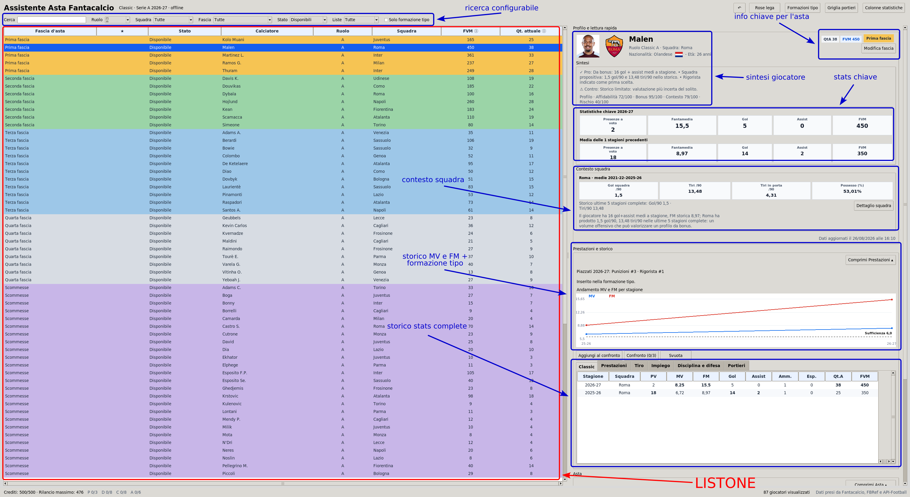
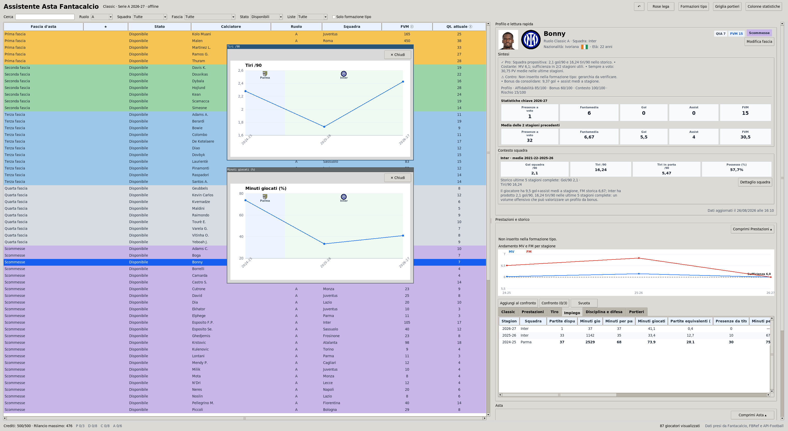
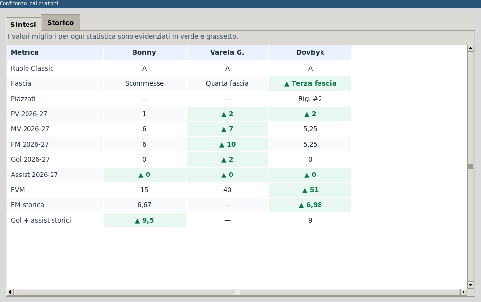
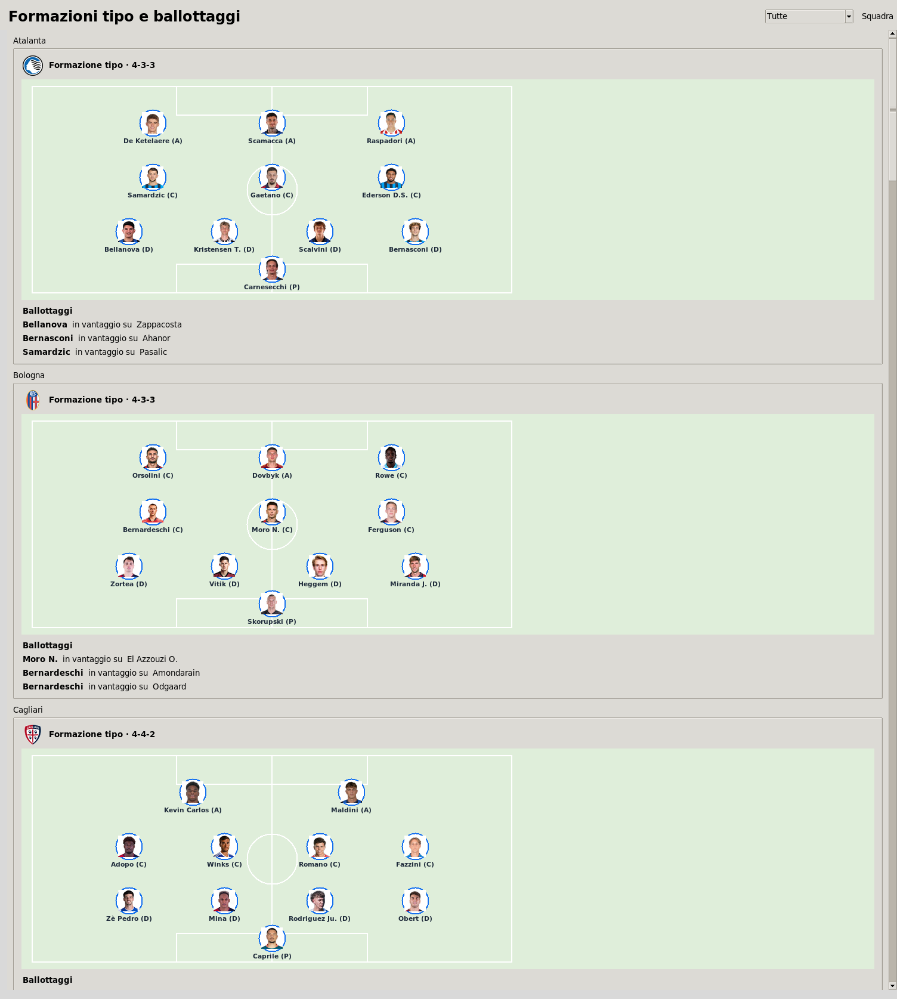
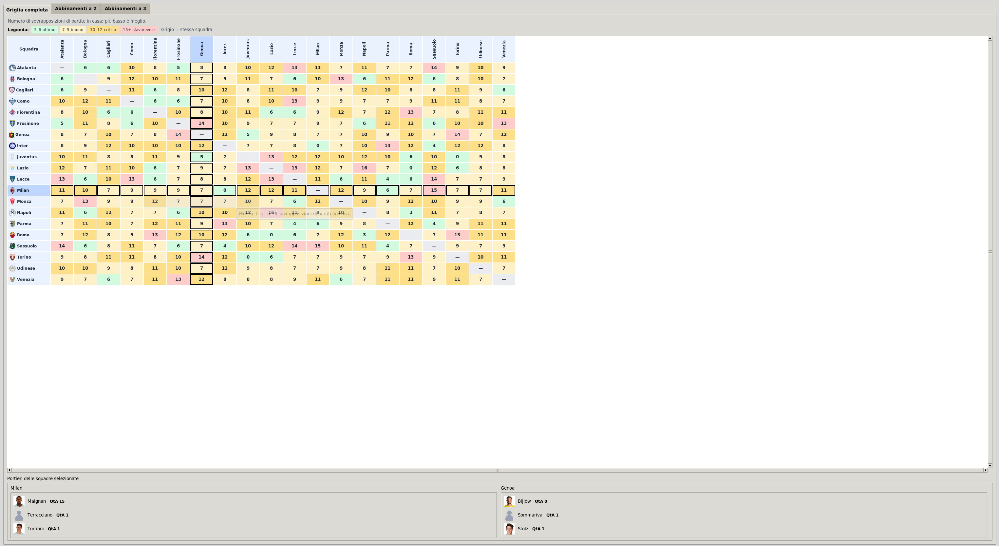

# ⚽ Assistente Asta Fantacalcio 2026-27

Un assistente desktop, in italiano e pensato per il **Fantacalcio Classic**, da tenere aperto durante l'asta. Riunisce dati storici, fasce, formazioni tipo, rose della lega, griglia portieri e strumenti di budget in un'unica applicazione utilizzabile offline.

L'obiettivo è semplice: prendere decisioni rapide senza perdere il contesto. Fascia, titolarità, ballottaggi, piazzati, statistiche e situazione della propria rosa restano sempre a portata di mano. 🎯

> Dati, rose, preferiti, note e cronologia dell'asta restano sul computer dell'utente. La repository pubblica separa i dati condivisibili dai dati locali e riservati.

**Ultimo update**: elenco giocatori aggiornato al 1 Settembre 2026.

## 🖼️ Anteprima

<p align="center">
  
</p>

<p align="center"><em>Elenco giocatori, fascia d'asta, scheda dettagliata e strumenti per l'asta live.</em></p>

<p align="center">
  
</p>

<p align="center"><em>Grafici storici ridimensionabili per leggere l'andamento delle statistiche.</em></p>

<p align="center">
  
  
</p>

<p align="center"><em>Confronto fra calciatori, formazioni tipo e ballottaggi.</em></p>

<p align="center">
  
</p>

<p align="center"><em>Griglia portieri con incroci, combinazioni e calendario compatto.</em></p>

## ✨ Cosa può fare

- Elenco ricercabile dei giocatori di Serie A 2026-27, ordinabile e filtrabile per ruolo Classic, squadra, fascia, preferiti, esclusi, disponibilità e formazione tipo.
- Scheda giocatore con foto, stemma, nazionalità, fascia d'asta, sintesi, statistiche Classic e statistiche calcistiche dettagliate.
- Grafici storici ridimensionabili per ogni statistica, con valori migliori evidenziati nelle tabelle.
- Lettura del **contesto squadra**: medie delle ultime cinque stagioni complete e commento che incrocia il profilo del giocatore con rendimento offensivo o difensivo della squadra.
- Formazioni tipo su campo, ballottaggi, titolari, fuori ruolo e gerarchie per rigori, punizioni e calci d'angolo.
- Modalità asta live con prezzo corrente, massimo rilancio sostenibile, Piano B, preferiti, esclusi e note personali.
- Rose permanenti della lega: crediti residui, spesa per ruolo, slot P/D/C/A, fasce, immagini e registro degli acquisti esportabile in CSV.
- Confronto affiancato fra due o tre calciatori e griglia portieri con combinazioni a due e tre squadre.

## 🖥️ Requisiti

L'app è scritta in Python e funziona su **Linux, Windows e macOS**. È necessario Python **3.10 o successivo**.

| Sistema operativo | Occorre installare |
| --- | --- |
| Linux | Python 3, Tkinter, `pip` e Pillow |
| Windows | Python 3 dal sito ufficiale, con Tcl/Tk incluso, e Pillow |
| macOS | Python 3 con Tkinter/Tcl-Tk e Pillow; l'installer da python.org è la scelta più semplice |

### Linux (Ubuntu/Debian)

```bash
sudo apt update
sudo apt install python3 python3-tk python3-pip
python3 -m pip install --user pillow
```

### Windows

1. Installa Python 3.10+ da [python.org](https://www.python.org/downloads/), selezionando **Add Python to PATH**.
2. Apri PowerShell nella cartella del progetto:

```powershell
py -m pip install pillow
py app.py
```

### macOS

Installa Python 3.10+ da [python.org](https://www.python.org/downloads/macos/) per avere anche Tcl/Tk. Poi, nel Terminale:

```bash
python3 -m pip install pillow
python3 app.py
```

Se compare `No module named PIL`, Pillow non è installato nell'interprete Python usato per avviare l'app. Se compare `No module named tkinter`, installa o reinstalla Python con il supporto Tcl/Tk del sistema.

## 🚀 Avvio rapido

1. Copia o estrai **l'intera cartella** del progetto: i percorsi dei dati sono relativi alla cartella di `app.py`.
2. Apri un terminale nella cartella del progetto.
3. Installa Pillow una sola volta e avvia l'app:

```bash
# Linux e macOS
python3 app.py

# Windows
py app.py
```

Al primo avvio vengono creati i database locali. Le successive aperture mantengono rose, acquisti, preferiti, note e cronologia.

Per importare nuovamente i file locali dopo un aggiornamento:

```bash
# Linux e macOS
python3 app.py --reimporta

# Windows
py app.py --reimporta
```

> `--reimporta` ricostruisce i dati importati delle fonti locali. Conserva una copia di `dati_riservati/` prima di usarlo se vuoi una fotografia separata della tua asta.

### Aggiornare i dati dopo una giornata di Serie A

Per avere quotazioni e statistiche aggiornate all’ultima giornata, accedi a [Fantacalcio](https://www.fantacalcio.it/) con il tuo account e scarica i file XLSX **Quotazioni** e **Statistiche** della stagione corrente. Sostituiscili nelle cartelle `quotazioni/` e `statistiche/`, quindi avvia l app con `--reimporta`.

## 🧭 Uso in asta

1. Apri **Rose lega**, inserisci i fantallenatori e indica quale è la tua squadra.
2. Cerca il giocatore nell'elenco principale e valuta prima la sua **fascia**, poi sintesi, titolarità, ballottaggi e statistiche.
3. Inserisci il prezzo nell'area **Asta live**: l'app mostra rilancio successivo e massimo sostenibile, preservando i crediti necessari a completare la rosa.
4. Registra l'acquisto alla squadra corretta. Disponibilità, rose, budget e registro si aggiornano subito.
5. Usa preferiti, esclusi, note e Piano B per non perdere le alternative.

Il budget predefinito è di **500 crediti**. Nella schermata **Rose della lega** puoi impostare un valore diverso e applicarlo a tutte le squadre; ogni rosa ha 3 portieri, 8 difensori, 8 centrocampisti e 6 attaccanti. I ruoli visualizzati sono esclusivamente quelli **Classic**: P, D, C e A.

## 🗂️ Struttura del progetto

| Percorso | Contenuto e utilizzo |
| --- | --- |
| `app.py` | Applicazione principale, interfaccia e migrazione automatica della precedente struttura dati. |
| `dati_condivisibili/dati_pubblici.sqlite3` | Catalogo condivisibile con statistiche FBref di giocatori/squadre e dati API-Football. |
| `dati_condivisibili/immagini/` | Foto dei giocatori, stemmi e bandiere inclusi nella repository. |
| `quotazioni/` | File Excel Classic scaricati manualmente da Fantacalcio; esclusi dalla repository. |
| `statistiche/` | File Excel Classic scaricati manualmente da Fantacalcio; esclusi dalla repository. |
| `statistiche_avanzate/` | CSV locali FBref di statistiche giocatore, usati solo per reimportare il catalogo pubblico. |
| `statistiche_squadre/` | CSV locali FBref di statistiche squadra, usati solo per reimportare il catalogo pubblico. |
| `griglia_portieri/` | Griglia e calendario testuale per l'analisi portieri; esclusi dalla repository. |

La vecchia cartella `dati_locali/` viene lasciata intatta come copia di sicurezza dopo la prima migrazione e rimane ignorata da Git.

## 📊 Dati, attribuzione e pubblicazione

I dati restano di proprietà dei rispettivi fornitori e sono soggetti alle loro condizioni d'uso:

- **Fantacalcio**: dati Classic, quotazioni e statistiche fantacalcistiche. Proprietà e diritti: [Fantacalcio](https://www.fantacalcio.it/). I file non vengono inclusi nella repository pubblica.
- **FBref / Sports Reference**: statistiche calcistiche storiche di giocatori e squadre. Proprietà e diritti: [FBref](https://fbref.com/) / [Sports Reference](https://www.sports-reference.com/). Quando si usano dati Sports Reference, è necessario citarli e fornire una menzione e/o un collegamento.
- **API-Football / API-Sports**: dati anagrafici, collegamenti a immagini e stemmi quando presenti. Proprietà e diritti: [API-Football](https://www.api-football.com/) / [API-Sports](https://www.api-sports.io/).

---

*Buona asta: informazioni ordinate, budget sotto controllo e decisioni più lucide.* 🏆
